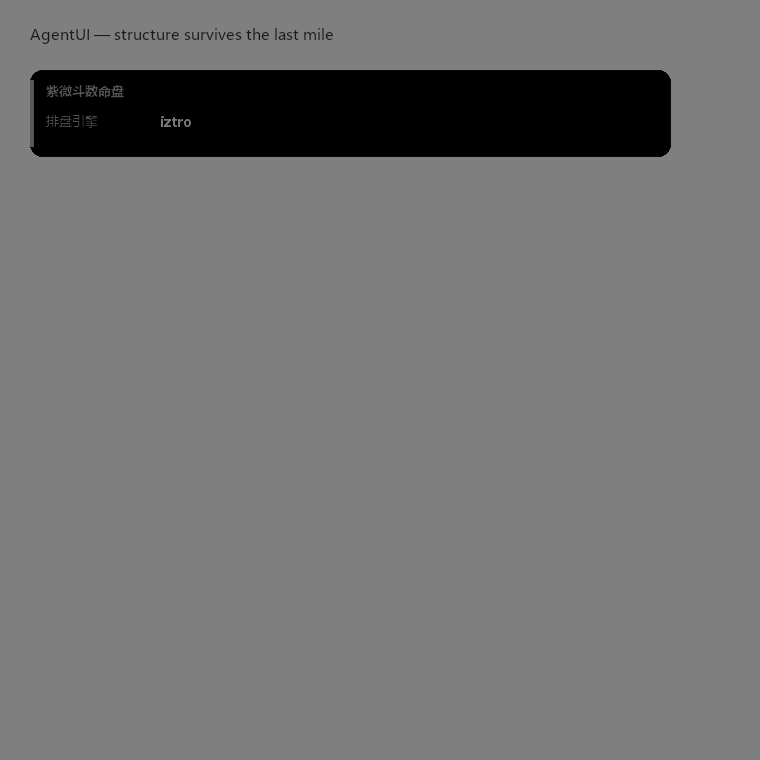

# AgentUI




**Declarative UI blocks for agent responses.** Your engine already produces
structure — tables, timelines, charts. AgentUI delivers that structure to the
user's screen directly, instead of letting the model flatten it into prose
(and introduce transcription errors along the way).

```
┌──────────────── engine ────────────────┐
│ palaces: [{name: 官禄, stars: [太阳]}, ...]
└──────────────┬─────────────────────────┘
               │  AgentUI block (JSON, validated)
               ▼
┌──────────── client ────────────────────┐
│ [ 紫微斗数命盘 ]  keyvalue card          │
│ [ 十二宫 ]        table card             │
│ [ 大运 ]          timeline card          │
└────────────────────────────────────────┘
```

## Why

- **Structure survives the last mile.** A model narrating a 12-palace chart
  will occasionally swap adjacent values (we measured it: engine says
  *Shatabhisha*, narration says *Dhanishta). Blocks bypass narration.
- **Controlled catalog, not arbitrary HTML.** Eight whitelisted components.
  No script injection surface; payloads are untrusted data and every
  reference renderer inserts them via `textContent`.
- **Bounded by contract.** Block counts, rows, columns, and cell lengths are
  capped on both sides — a misbehaving producer cannot blow up a client.
- **Forward-compatible.** Events carry `uiVersion`; a client that supports
  version N silently drops whole events above N. Degrading to text-only is
  always safe.

## The v1 catalog

| Component | Purpose |
|---|---|
| `keyvalue` | label/value overview card |
| `table` | record list |
| `form` | structured input — multi-step, conditional fields, validated |
| `timeline` | ordered periods with a "now" marker |
| `compare` | two-party dimension comparison (score bars) |
| `download` | client-side file export (Blob, never fetches) |
| `chart` | line / bar chart (SVG, no chart libraries) |
| `calendar` | day cards (almanac-style: 宜/忌/干支 or your own labels) |

Full contracts: [`spec/wire-protocol.md`](spec/wire-protocol.md) and
[`spec/schemas/*.schema.json`](spec/schemas/).

## Install / use

### JavaScript (consumer)

```html
<script src="agentui.js"></script>
```

```js
// Inside your SSE loop:
//   data: {"type":"UI","data":{"uiVersion":1,"blocks":[...]}}
AgentUI.handleEventData(logElement, msg.data);   // version-gated, catalog-gated

// Or render directly:
const node = AgentUI.render(block);              // HTMLElement | null
AgentUI.appendBlocks(logElement, blocks);

// Optional: inject the default stylesheet (aub-* prefixed classes)
const style = document.createElement('style');
style.textContent = AgentUI.CSS;
document.head.appendChild(style);
```

No dependencies. Run the tests: `node test/agentui.test.mjs` (uses a minimal
DOM stub — no jsdom needed).

### Python (producer)

```bash
pip install ./python        # or: uv run --project python pytest
```

```python
from agentui import keyvalue, table, ui_event, validate

block = table(["宫位", "主星"], [["官禄", "太阳"], ["迁移", "天机"]], title="十二宫")
assert not validate(block)
event = ui_event([keyvalue([("引擎", "iztro")]), block])
# → {"uiVersion": 1, "blocks": [...]}  — send as your UI event payload
```

## Security model

1. **Payloads are data, not code.** No block field is evaluated or injected
   as HTML. The `download` component materializes files client-side from
   `fileText`; it never fetches URLs found in a block.
2. **Rendering is text-only** in both reference implementations.
3. **Fail closed on garbage.** Malformed blocks are dropped, not repaired.
4. **Both sides enforce caps.** Producers clip; renderers clip again.

## Versioning

Protocol version 1. Breaking wire changes bump `uiVersion`; clients drop
what they don't understand, so old deployments keep working against new
producers. See [CHANGELOG](CHANGELOG.md) if we add one.

## License

[Apache-2.0](LICENSE). © 2026 The AgentUI authors.
